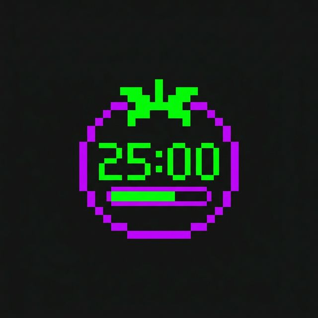

# Pomodoro Timer ⏱️

A premium, 8-bit aesthetic Pomodoro Timer application built with React, Vite, and Electron. It features high-precision timers, a physical-feeling vertical drum scroll interaction, and dynamic phase themes (Neon Purple for 'Lock-In' focus, Neon Green for 'Recovery').



## Features
- **Physical Controls**: Vertical scroll digit selection powered by `framer-motion` to replicate analog dials.
- **Dynamic Watch Faces**: Timer interface seamlessly adapts between selection mode and a clean active countdown mode.
- **Immersive Backdrop**: A gorgeous, reactive `FaultyTerminal` neon backdrop that subtly shifts based on the timer phase.
- **Audio & Notifications**: Native browser notifications and synthesized Web Audio API beeps safely tie into your work phases.

## Getting Started (Web Version)
To run the standard web-based sandbox version of the timer:

1. Install dependencies:
   ```bash
   npm install
   ```
2. Start the Vite development server:
   ```bash
   npm run dev
   ```
3. Open `http://localhost:5173` in your browser.

## Desktop Application (Electron)

The application has been explicitly boundled into a standalone native macOS application executable. You do not need to rely on the browser to use it!

### Run Electron in Development
To test the desktop app wrapper while actively developing (with Hot Module Replacement):
```bash
npm run electron:dev
```

### Build the macOS App
To compile all dependencies and package the desktop application into a standalone `.app` binary:
```bash
npm run electron:build
```
Once the build script successfully completes, navigate your Finder to the `release/mac-arm64/` directory inside this project folder. You will find `Pomodoro Timer.app` there! 

You can drag and drop this application directly into your `Applications` folder or onto your Desktop for quick, permanent access.
